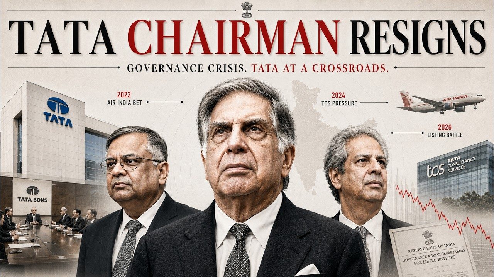

# Business Analyst Case Study Series: The Tata Sons Leadership Crisis

An Analytical Guide to Capital Control, Regulatory Compliance, and Stakeholder Governance.

*   **Topic:** Corporate Governance, Capital Redistribution, NBFC Regulations
*   **Focus Entity:** Tata Sons Private Limited & Subsidiary Companies
*   **Frameworks Utilized:** 5 Whys Root-Cause, Capital Flow Scenario Modeling
*   **Context Date:** August 20, 2026

---

## Table of Contents
1. [Case Study Introduction](#1-case-study-introduction)
2. [The Business Problem](#2-the-business-problem)
3. [Financial Data & Analysis](#3-financial-data-analysis)
4. [Root Cause Analysis (5 Whys)](#4-root-cause-analysis-5-whys)
5. [Proposed Solutions Comparison](#5-proposed-solutions-comparison)
6. [The Strategic Recommendation](#6-the-strategic-recommendation)
7. [Implementation Plan & Key KPIs](#7-implementation-plan-key-kpis)
8. [Business Analyst Interview Preparation (Q1 - Q10)](#8-business-analyst-interview-preparation-q1---q10)
9. [Key Business Analyst Lessons & Takeaways](#9-key-business-analyst-lessons-takeaways)
10. [Executive Case Summary](#10-executive-case-summary)

---

## 1. Case Study Introduction

Tata Sons serves as the holding company of the Tata Group, one of the largest conglomerates globally with operations spanning IT (TCS), aviation (Air India), steel (Tata Steel), automotive (Tata Motors), and electronics. Operating as a holding company, Tata Sons does not make consumer products directly. Instead, its unique business model involves holding majority shares in other listed Tata companies, collecting dividends from highly profitable entities, and reinvesting that cash to rescue struggling operations or launch capital-heavy, high-risk new ventures (such as semiconductor fabrication and digital ecosystems).

**The Catalyst Event:** Chairman N. Chandrasekaran, who successfully grew the group's market value by an outstanding 3x, suddenly resigned after refusing a third term. This unexpected leadership vacuum immediately wiped out USD 4.5 billion in market value. This case highlights the profound strategic friction that arises when standard corporate financial principles (doing what is mathematically optimal for minority shareholders) clash with the long-term philanthropic mandates of the majority owners (the Tata Trusts, which hold a 66% stake).

> 💡 **Mentor Context (Understanding the System):**
> Imagine Tata Sons as a giant water pool. One massive inlet pipe (TCS) pumps massive volumes of water in. Multiple drainage pipes (Air India, Tata Electronics) are constantly draining water out. The owners (Tata Trusts) want to keep the pool private to control the valves in absolute secrecy. The government regulator (RBI), however, wants them to put a glass wall around the pool and make it public. That is the core dynamic of this crisis.

---

## 2. The Business Problem

**The Core Conflict:** The Chairman was forced out because he refused to sign an internal board guarantee pledging that he would block Tata Sons from going public. The Reserve Bank of India (RBI) mandates that Tata Sons, due to its financial scale and debt structure, must list on the public stock exchange. However, the majority owners (the Tata Trusts, led by Noel Tata) refuse to let an Initial Public Offering (IPO) happen under any circumstances.

**Why Public Listing is a Threat:** If Tata Sons lists publicly, retail and institutional investors gain voting rights and regulatory visibility. Currently, Tata Sons operates with an executive 'superpower'—it can unilaterally decide to inject INR 20,000 crores into loss-making Air India in a single day. If the company is publicly traded, minority shareholders will aggressively vote against throwing high TCS dividends into high-burn projects, severely crippling the conglomerate's ability to take long-term, capital-heavy strategic bets.

---

## 3. Financial Data & Analysis

As Business Analysts, we look past headlines and dive directly into the cash flow and corporate structure data. The financial reality of the Tata Sons holding model is characterized by extreme concentration of profits versus widespread capital redistribution across private subsidiaries:

### Table 1.0: Tata Sons Stakeholder & Financial Metrics

| Segment / Shareholder | Entity | Financial Metric | Strategic Role & Impact |
| :--- | :--- | :--- | :--- |
| **Cash Cow (Inflow)** | TCS | INR 52,000 Cr Profit | The primary cash engine. Generates massive dividends that fund the group. |
| **Cash Burn (Outflow)** | 16 Private Cos. | INR 31,822 Cr Total Loss | Aviation, semiconductor, and tech bets requiring continuous CapEx. |
| **Key Drag (Outflow)** | Air India | INR 22,238 Cr Net Loss | The single most expensive turnaround effort in the conglomerate's history. |
| **Majority Owner (66%)** | Tata Trusts | 66.0% Stake (Private) | Philanthropic entity; requires private structure to direct capital freely. |
| **Minority Owner (18.4%)** | SP Group | 18.4% Stake (Private) | Desperately requires IPO/listing liquidity to clear their own heavy debts. |

*(Data represents fiscal year summaries representing extreme cash concentration and structural leverage)*

> 📊 **BA Modeling Perspective:**
> If a BA were to model this in Excel or SQL, they would construct a Cash Flow Scenario Model to project TCS dividend inflows over a 5-year horizon against the required CapEx for Air India and Tata Electronics. A BA would run a sensitivity analysis: *'What happens to our group cash reserves if TCS profits drop by 10% (due to AI disruption) while Air India's path to break-even is delayed from 2027 to 2032?'* This proves that the group's model is highly sensitive to the financial health of TCS.

---

## 4. Root Cause Analysis (5 Whys)

To separate surface symptoms from the real strategic issue, we apply the 5 Whys Framework to map the sequence of events and reveal the fundamental root cause:

1.  **Why did the Chairman resign?**
    Because he refused to sign a board document guaranteeing he would block Tata Sons from going public.
    *   *leads to...*
2.  **Why did Noel Tata (representing the Trusts) demand this signature?**
    Because the RBI classified Tata Sons as an Upper-Layer NBFC, forcing a public stock listing, and Noel Tata wanted to ensure the Chairman fought the regulator's mandate.
    *   *leads to...*
3.  **Why do the Tata Trusts oppose public listing so aggressively?**
    Because a public listing forces transparency, giving minority shareholders voting rights over 'related-party transactions' under strict market laws.
    *   *leads to...*
4.  **Why is minority voting power a threat to the Trusts' model?**
    Because public minority shareholders would logically vote to block Tata Sons from taking TCS dividends and dumping them into loss-making private bets like Air India.
    *   *leads to...*
5.  **Why did the Chairman refuse to sign the guarantee? (The Root Cause)**
    Because as Chairman, he has a strict fiduciary duty to all shareholders, including the 18.4% minority owner (Shapoorji Pallonji Group), who desperately needs the IPO to gain public liquidity and clear their own crushing debt burden.

**The Root Cause Summary:** A fundamental, structurally irreconcilable alignment failure. The majority owner (Trusts) requires absolute private control to fund long-term philanthropy and nation-building projects, while the regulator (RBI) and minority owners (SP Group) require liquidity, compliance, and public-market oversight.

---

## 5. Proposed Solutions Comparison

A Business Analyst must always evaluate multiple strategic paths. Here, we analyze three distinct approaches to resolve the tension between regulatory compliance and corporate control:

### Table 2.0: Strategic Solutions Matrix

| Strategic Option | Mechanism | Benefits (Pros) | Limitations (Cons) |
| :--- | :--- | :--- | :--- |
| **1. List Tata Sons (RBI Route)** | Perform an IPO in compliance with upper-layer NBFC rules. | Resolves RBI compliance immediately; provides exit liquidity for SP Group. | Trusts lose unilateral capital allocation control; minority votes can block high-risk projects. |
| **2. Corporate Restructuring** | Restructure the balance sheet (repaying holding debt/assets) to drop NBFC status. | Avoids IPO mandate legally; preserves private capital control for the Trusts. | Highly complex; requires massive, rapid debt repayment and asset transfers. |
| **3. External PE Funding** | Stop funding Air India from Tata Sons; raise Private Equity for aviation. | Protects TCS dividend flows; removes minority shareholder objections to listing. | Extremely difficult to find PE investors willing to back an entity burning INR 22,238 Cr per year. |

---

## 6. The Strategic Recommendation

**The Analyst Recommendation:** Tata Sons must aggressively pursue **Option 2: Corporate Restructuring** to legally drop the 'Upper-Layer NBFC' status, thereby removing the legal requirement from the RBI to list.

**Strategic Rationale:** The competitive advantage of the Tata Group lies in its private holding structure. The unique ability to make massive, capital-intensive, 10-to-20-year bets (like semiconductor fabrication, green energy, and aviation) without the constant pressure of quarterly earnings or public market volatility is why the group survives and leads. If Tata Sons is listed on the stock exchange, public retail investors will logically demand short-term yields, ultimately starving future growth engines of necessary capital.

**Key Risks:** Choosing this route means the minority shareholder (SP Group, holding 18.4%) remains trapped without a clear liquidity exit. This is highly likely to trigger further litigation, with the SP Group potentially suing Tata Sons again for minority shareholder oppression. Legal teams must prepare structural compromises, such as spinning off or listing specific mature private subsidiaries to provide SP Group partial liquidity.

---

## 7. Implementation Plan & Key KPIs

To execute Option 2, the Business Analyst recommends a dual-track implementation framework:

### Phase I: Governance Alignment
*   **Step 1:** Appoint a new group Chairman whose vision is perfectly aligned with the long-term, philanthropic focus of the Tata Trusts.
*   **Step 2:** Establish an internal committee consisting of legal, compliance, and corporate finance experts to map the holding company's debt threshold.

### Phase II: Financial Restructuring
*   **Step 3:** Accelerate the repayment of holding-level debt or execute selective internal asset transfers to change Tata Sons' classification, safely exiting the Upper-Layer NBFC threshold.
*   **Step 4:** Propose the listing of high-performing, non-core mature private subsidiaries (e.g., Tata Capital or Tata Technologies) to provide SP Group an alternative, legal path to liquidity.

### Key Performance Indicators (KPIs) to Track:
1.  **Core Investment Company (CIC) Metrics:** Track the exact Debt-to-Equity and asset ratios of the holding company to ensure they fall and remain safely below the RBI's Upper-Layer NBFC listing thresholds.
2.  **TCS Free Cash Flow Dividend Yield:** Closely monitor TCS top-line and bottom-line trends. Since TCS generates INR 52,000 Cr in profit, any decline directly chokes the group's investment capacity.
3.  **Private Subsidiary Cash Burn Rate:** Measure the burn rate of Air India (currently losing INR 22,238 Cr) and Tata Electronics to ensure they do not exceed holding company capital reserves before reaching profitability.

---

## 8. Business Analyst Interview Preparation (Q1 - Q10)

This case study is highly valued in elite BA interviews because it tests macro-level thinking, understanding of corporate finance, and stakeholder management.

### Q1. Business Model: "Tata Sons has no direct consumer products. How does it generate money, and why is it so powerful?"
*   **Exemplary Answer:** Tata Sons is a pure holding company. It generates revenue by collecting dividend payouts from its highly profitable listed operating companies, primarily TCS, and redistributes that capital to fund capital-heavy private subsidiaries. Its power lies in acting as the central capital allocator, controlling the cash flow across a USD 300 billion empire.
*   **Interviewer is testing:** Do you understand the difference between holding companies and operating companies?

### Q2. Problem Solving: "If you were the Chairman, how would you balance the demands of the Trusts against the SP Group?"
*   **Exemplary Answer:** I would seek a structured compromise. I would keep the core holding company private to protect the Trusts' strategic superpower, but I would structure an alternative liquidity path for the SP Group—such as initiating IPOs for private subsidiaries like Tata Capital, allowing SP Group to swap shares and exit.
*   **Interviewer is testing:** Your capacity to find creative, data-backed compromises in complex stakeholder conflicts.

### Q3. Data Analysis: "TCS profits grew slightly, but IT sector job demand is at a 28-month low. What does this suggest about Tata Sons' cash flow?"
*   **Exemplary Answer:** A low job demand suggests top-line stagnation in the IT sector, meaning TCS's profit growth is driven by cost-cutting rather than expansion. If TCS revenue plateaus due to macroeconomic headwinds, its future dividend payouts to Tata Sons will flatten, putting the high-cap CapEx of Air India at severe risk.
*   **Interviewer is testing:** Can you connect macroeconomic indicators to micro-level corporate cash flow forecasts?

### Q4. KPI Selection: "If you are monitoring Air India's turnaround, what top 3 KPIs would you present to the Tata Sons Board?"
*   **Exemplary Answer:** I would avoid vanity metrics and present:
    1.  *Monthly Cash Burn Rate* (liquidity impact)
    2.  *Passenger Load Factor* (operational efficiency)
    3.  *Revenue per Available Seat Kilometer (RASK) vs Cost per Available Seat Kilometer (CASK)* (unit profitability)
*   **Interviewer is testing:** Your ability to select highly actionable financial and operational metrics over generic metrics.

### Q5. Root-Cause Analysis: "Why does public listing stop a company from taking long-term, loss-making strategic bets?"
*   **Exemplary Answer:** Public listing introduces strict fiduciary duties to minority public shareholders and institutional investors. By law, these investors can vote on related-party transactions. They expect short-term dividend yields and will block the transfer of massive cash reserves to high-risk, long-term projects.
*   **Interviewer is testing:** Do you understand corporate governance, regulatory compliance, and shareholder behavior?

---

### Q6. SQL & Excel Thinking: "How would you structure a database schema to track the capital flow from listed subsidiaries to private subsidiaries?"
*   **Exemplary Answer:** I would design a relational schema. An `Entities` table (`Entity_ID`, `Name`, `Listing_Status`) would track subsidiaries. A `Transactions` table (`Tx_ID`, `Source_ID`, `Target_ID`, `Amount`, `Date`, `Category`) would log the flows. I would write a SQL query joining these tables, grouping by `Target_ID`, and summing `Amount` where `Category = 'CapEx'` to isolate cash burn.
*   **Interviewer is testing:** Your ability to translate messy, real-world business flows into structured relational database schemas.

### Q7. Stakeholder Management: "The RBI demands a listing, and the Trusts demand staying private. How does a BA handle this?"
*   **Exemplary Answer:** A BA treats regulations as hard constraints. I would map out the exact legal parameters of the RBI rule, identify the debt-to-equity and asset thresholds, and perform financial scenario modeling to present to the Board the exact cost and asset reorganization required to legally avoid the mandate.
*   **Interviewer is testing:** Do you panic in high-stakes conflicts, or do you treat legal and regulatory rules as math constraints?

### Q8. Decision Making: "Air India is projected to lose money for the next 5 years. Do you cut funding now or keep going?"
*   **Exemplary Answer:** I would evaluate the 'Sunk Cost' against 'Future Market Value.' If the Indian aviation market is projected to grow 5x and quitting means writing off INR 47,000 Cr with zero salvage value, keeping going is logical—but only if our TCS Cash Flow Model proves the holding company can fund the runway without choking.
*   **Interviewer is testing:** Can you make objective, data-driven decisions without succumbing to the 'sunk cost fallacy'?

### Q9. Communication: "Explain the complex holding company structure of Tata Sons to a five-year-old child."
*   **Exemplary Answer:** Imagine a giant piggy bank. A big charity owns the biggest piece of the piggy bank, a builder owns a small piece, and the government is trying to force them to let strangers look inside and vote on who gets the money. The family is fighting because they want to keep it a secret.
*   **Interviewer is testing:** Your capacity to distill extreme structural complexity into simple, highly relatable analogies.

### Q10. Strategic Recommendation: "Is a company better off controlled by philanthropic trusts or public shareholders?"
*   **Exemplary Answer:** It is highly dependent on the lifecycle stage. Absolute trust control is highly superior for high-risk, long-term 'zero-to-one' capital bets (like semiconductors). Public shareholder control is superior for mature, cash-generating stages because it enforces capital discipline, transparency, and cost efficiency.
*   **Interviewer is testing:** Do you realize there is no 'perfect' structure in business, only structures that fit specific phases?

---

## 9. Key Business Analyst Lessons & Takeaways

### Skills Practiced & Developed in This Case:
*   **Business Understanding:** Deepened knowledge of holding company dynamics, trust structures, and equity ownership.
*   **Analytical Thinking:** Looked past surface-level news (a Chairman's resignation) to identify multi-billion dollar systemic cash conflicts.
*   **Root-Cause Analysis:** Applied 5 Whys to link regulatory RBI NBFC guidelines to board-level leadership changes.
*   **Stakeholder Management:** Mapped out the conflicting objectives of regulators (RBI), majority owners (Trusts), and minority owners (SP Group).

### Core Takeaways:
*   **Cash Flow is King:** Even a USD 300 billion empire is highly vulnerable if its central cash generator (TCS) faces top-line stagnation while its private ventures increase their capital burn rate.
*   **Structure Dictates Strategy:** The legal and ownership structure of a conglomerate dictates what it is allowed to do. Tata's private holding company status is their ultimate strategic weapon, allowing multi-decade bets.
*   **The 'Why' Behind Regulations:** Government guidelines (like the RBI NBFC rules) are designed to protect public funds but often clash with private conglomerate models. A BA must map the financial trade-offs of compliance.
*   **Fiduciary Duty is Complex:** Executive leaders face situations where doing what is right for the majority owners is deeply harmful or illegal regarding the rights of minority owners. Data and modeling help clarify the impact.

> 📝 **Why This Case Matters for BA Prep:**
> Standard business analyst preparation often revolves around simple, isolated cases like 'revenue declined in a retail store.' In the real world, business is messy. It involves complex holding companies, regulatory frameworks, debt restructuring, and intense board politics. Masterfully analyzing this case proves you can think at an executive, macro-strategic level, making you stand out in competitive interviews.

### Recommended Next Practice:
**The WeWork Downfall Case Study:** Analyze the stark clash between high private valuations, extreme cash burn rates, and the brutal realities of trying to list publicly when unit economics are fundamentally broken.

---

## 10. Executive Case Summary

*   **The Resignation:** The successful Chairman of Tata Sons resigned suddenly, wiping out USD 4.5 billion in group market value.
*   **The Catalyst:** The Reserve Bank of India (RBI) mandated that Tata Sons must list publicly due to its financial scale and classification.
*   **The Conflict:** Tata Trusts (66% owners) refuse public listing to protect private funding control; SP Group (18.4%) needs the listing for exit liquidity.
*   **The Cash Imbalance:** Tata Sons relies entirely on TCS dividends (INR 52,000 Cr profit) to fund private cash-burn operations like Air India.
*   **The Board Dilemma:** The Chairman could not comply with the Trusts' demand to block the IPO without violating his fiduciary duty to the SP Group.
*   **The Analytical Takeaway:** Corporate strategy is ultimately dictated by capital flow mechanics, ownership structures, and regulatory compliance.
